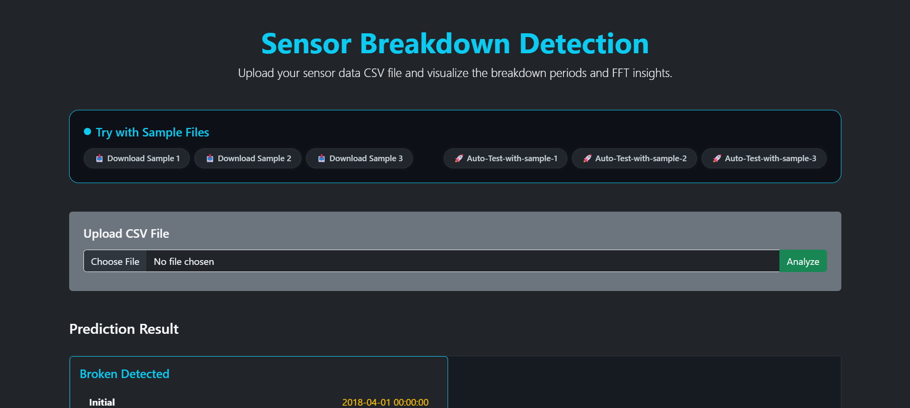

# 🔧 Pump Breakdown Predictor

This project predicts breakdowns and recovery phases of an industrial centrifugal pump using sensor data (like vibration, temperature, etc.) and a trained ML model.

## 🚀 Live App

👉 [Click here to try the app](https://web-production-bebef.up.railway.app)

---

## 📦 Overview

Given time-series sensor data, the app:
- Uses FFT to extract features
- Applies a trained RandomForest model
- Predicts machine status (`Healthy`, `Broken`, `Recovering`)
- Visualizes breakdown and recovery periods

---

## 🔧 Tech Stack

- **Frontend**: HTML/CSS/JS
- **Backend**: Flask (Python)
- **ML**: scikit-learn, XGBoost, pandas, numpy
- **Deployment**: Railway (Docker-based)

---

## 📁 How to Use

1. Upload your `.csv` file containing sensor data
2. The backend extracts features & predicts status
3. The output includes breakdown/recovery segments & optional visualizations

---

## 📄 Example Input CSV Format

| timestamp        | vibration | flow_rate | temperature | ... |
|------------------|-----------|------------|-------------|-----|
| 2025-07-01 00:00 | 0.0035    | 1.26       | 35.2        | ... |
| 2025-07-01 00:01 | 0.0037    | 1.20       | 35.3        | ... |

---

## 📸 Screenshots

### 🏠 Home Page  

### 📂 File Upload  

### 📈 Prediction Output  

### ✅ Deployment Success  

---

## 👩‍💻 Author

Made with ❤️ by [Anchal Gupta](https://github.com/AnchalGupta1117)

